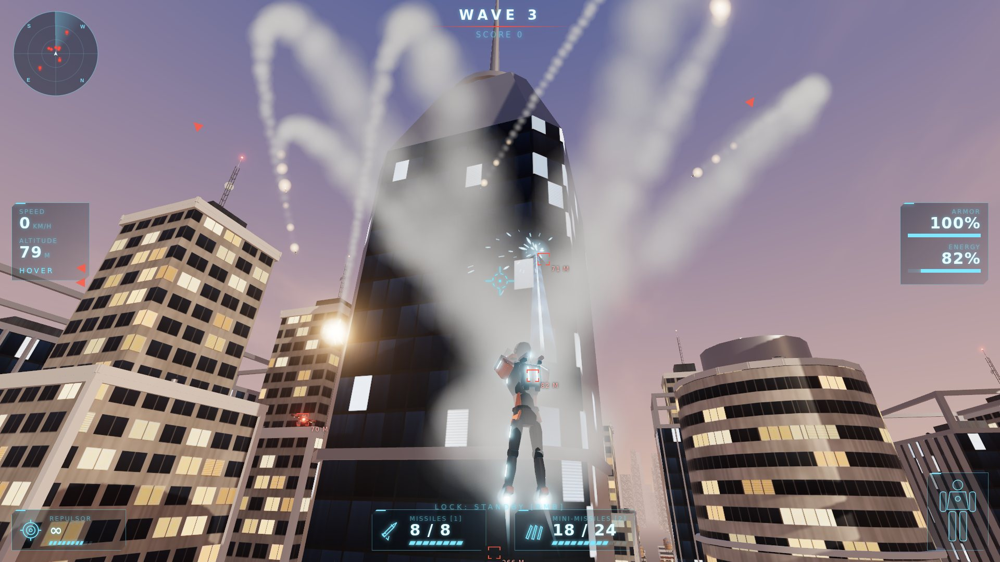

# Armored Flight

A single-player 3D action game for the browser. You pilot a powered armor suit through a
destructible city at sunset, fighting drone swarms, rooftop missile batteries and a shielded
armored behemoth.


 
  <!-- coders-talk:repo -->
## Built with AI

[](https://coders.talk/b/build-a-browser-based-3d-flight-combat-game-with-blender-procedural-as?utm_source=github&utm_medium=readme&utm_campaign=build)

**Build a browser-based 3D flight-combat game with Blender-procedural assets**  
Claude Code · Opus 5.5  
3h 17m · zero-touch · 1 agent fail

[View the full build →](https://coders.talk/b/build-a-browser-based-3d-flight-combat-game-with-blender-procedural-as?utm_source=github&utm_medium=readme&utm_campaign=build)
<!-- /coders-talk:repo -->
 

- **Runtime:** Vite + TypeScript + Three.js, with Rapier (`@dimforge/rapier3d-compat`, WASM) for
  physics and an HTML/CSS HUD. Everything runs client-side, with no server, backend or network API.
- **Art:** every 3D asset is generated by Blender Python scripts in `tools/blender/` and exported
  as GLB to `public/assets/`. There are no downloaded models. Textures, sprites and sounds are
  also procedural.

## Requirements

| Tool | Version |
| --- | --- |
| Node.js | 20.19+ or 22.12+ (required by Vite 7; developed on Node 22) |
| npm | 10+ |
| Blender | 4.2 or newer (developed with Blender 5.0). Only needed to regenerate assets. |

Generated GLBs are committed, so you can run the game without Blender. Blender only matters
when you regenerate the art.

## Install

```bash
npm install
```

## Generate assets

```bash
npm run assets
```

This runs `tools/blender/build_all.py` headless with
`blender -b --factory-startup --python-exit-code 1 -P tools/blender/build_all.py`,
then `tools/verify-assets.mjs`. It looks for Blender in this order:

1. The `BLENDER` environment variable (path to the executable).
2. `blender` on `PATH`.
3. Common install locations (macOS `/Applications`, Windows `Program Files`, Linux).
4. A Python interpreter that can `import bpy` (the official `bpy` wheel: `pip install bpy`).

The build takes a few seconds and is deterministic: all randomness is seeded and a rebuild
produces byte-identical GLBs. If Blender is missing or any script fails, the command exits
with an error. To check existing assets without rebuilding them, run `npm run assets:verify`.

## Run

```bash
npm run dev
```

Open the printed URL (default `http://localhost:5173`) in a desktop browser with WebGL 2
(Chrome, Edge or Firefox), then click **Launch**. The game captures the mouse; press **Esc**
to pause.

## Build

```bash
npm run build     # verifies assets, type-checks, bundles into dist/
npm run preview   # serves the production build
```

## Controls

| Input | Action |
| --- | --- |
| Mouse | Aim / steer |
| W / S | Thrust forward / reverse |
| A / D | Strafe |
| Space / C | Ascend / descend |
| Q / E | Roll (flight mode) |
| Shift | Boost (drains energy) |
| F | Toggle hover / flight mode |
| Left mouse | Repulsors (alternating palms, uses energy) |
| Right mouse (hold) | Acquire a target lock |
| Tab | Switch target |
| 1 | Homing missile (needs a lock) |
| 2 | Mini-missile salvo (spreads over nearby targets) |
| H | Controls overlay |
| M | Mute |
| Y | Invert mouse Y |
| Esc | Pause |

Descend is bound to **C** rather than Ctrl, because Ctrl+W closes the browser tab.

## How to play

You start on a helipad. Press **Space** to lift off, and **F** to switch between agile hover
and fast flight. The fight runs in five waves:

1. Drone scouts
2. A drone swarm with reinforcements
3. Drones plus rooftop missile turrets
4. Heavy pressure (drones and turrets)
5. The Armored Behemoth

Between waves you get a short breather, an armor repair and a munitions restock. Missiles
also trickle back during combat.

- **Repulsors** are hitscan and cost energy. Boosting also costs energy, so you cannot fire and
  boost indefinitely.
- **Locks** take time: hold RMB with the target inside the lock cone. Drifting off target bleeds
  progress. Losing sight, range or the wider cone breaks the lock.
- **Enemy missiles** can be shot down with repulsors, which earns bonus score.
- **Boss:**
  - Phase 1: the shield only takes missile damage.
  - Phase 2: the hull is exposed. The boss adds charge dashes and area blasts.
  - Phase 3: below 35 % hull it becomes critical and turns faster and angrier.
- **Score** comes from kills, missile interceptions, wrecked city props (chained into combos up to
  x5) and boss damage.

## Architecture

```
src/
  game/      Game (frame loop and state flow), Assets, Input, Renderer (HDR, bloom, dynamic resolution),
             Combat (explosions and splash), Score, WaveManager, AudioSystem (WebAudio synthesis), constants
  physics/   Physics: Rapier world, collision groups, raycasts, collider -> Hittable registry
  player/    FlightModel (6DoF dynamics), PlayerController (Rapier body, armor/energy/ammo),
             PlayerVisual (pose blending, arm aiming, thrusters), PlayerCamera (chase camera and aim ray)
  weapons/   TargetingSystem, RepulsorSystem, Missile + MissilePool, MissileSystem, MiniMissileSystem, EnemyBolts
  enemies/   Enemy base, Drone, Turret, Boss + BossAttacks + BossShield, EnemyManager
  world/     CityLayout, CityBuilder, CityProps, InstancedKit, Environment (sky, lights, fog, bay, skyline),
             DestructionSystem, DebrisSystem
  fx/        Particles (instanced billboards), ExplosionFx, BeamFx, ThrusterFlame, ShieldMaterial, LightPool, textures
  hud/       Hud (DOM tactical display), TargetMarkers, Radar, Overlays (menus), hud.css
  assets.json  single manifest of every GLB (used by the loader and by verify-assets)
tools/
  blender/   bpy scripts that author and export every asset
  build-assets.mjs, verify-assets.mjs
public/assets/  generated GLBs
```

### Key systems

- **Flight.**
  - `FlightModel` keeps a full quaternion orientation. Mouse input yaws and pitches, Q/E rolls,
    and a roll assist levels the wings when you are not rolling.
  - Thrust is acceleration-based with quadratic and linear drag, so there are real inertia and
    terminal speeds. Normal cruise is about 230 km/h and boost about 430 km/h.
  - Hover mode uses horizontal thrust with stabilizer damping.
  - The resulting velocity drives a Rapier dynamic capsule with CCD. The capsule's axis follows
    the suit (upright in hover, along the heading in flight), and collisions feed the corrected
    velocity back. Hard impacts damage the armor.
- **Camera.** The chase camera uses a damped orientation and lags under acceleration. It pulls
  back with speed, widens the FOV and vibrates while boosting, pulls in to avoid walls, and has
  trauma-based shake and weapon recoil. The crosshair ray (a Rapier raycast) defines the aim
  point for every weapon.
- **Weapons.**
  - Repulsor beams leave the actual palm reactors, and the aiming arm is posed procedurally.
  - Missiles are Rapier kinematic sensors. They boost out of the shoulder rails and then blend
    guidance in with a finite turn rate and target leading.
  - Hits use swept raycasts and proximity fuses. Hostile missiles are registered hittables, so
    repulsors can shoot them down.
- **AI.** Enemies use small finite state machines:
  - Drone: spawn, approach, orbit, attack, evade, reposition, destroyed. Each drone has its own
    randomized orbit, altitude and fire parameters, plus obstacle avoidance and separation, and
    only a few may fire at once.
  - Turret: idle, acquire, track, fire, cooldown, destroyed. It uses an intercept solution, and
    its yaw and pitch nodes rotate at finite rates.
  - Boss: intro, shielded, exposed, critical, dying.
- **Destruction.**
  - Intact props are instanced, with one fixed Rapier cuboid each.
  - On destruction, the instance is hidden, the collider is removed, and the Blender-fractured
    chunks spawn as dynamic Rapier bodies with convex-hull colliders. They are pushed away from
    the blast with random spin.
  - Chunks freeze after 5 s, or oldest-first when more than `MAX_ACTIVE_DEBRIS = 80` are active.
    Frozen piles are merged into one static mesh per material, and old piles are recycled.
- **Rendering.**
  - The whole city renders from about a hundred instanced meshes. Sun shadows follow the player.
  - Effects use pooled instanced billboards: smoke, fire, sparks and shock rings, plus a fixed
    pool of point lights that fade quickly.
  - The sky and image-based lighting come from the same procedural sunset shader. Post
    processing is HDR with MSAA, bloom and ACES tone mapping.
  - Resolution scales down automatically if the frame rate drops. Add `?quality=low` or
    `?quality=high` to the URL to override it.

## Asset pipeline

All art is produced by `tools/blender/*.py` (`bpy` + `bmesh`), run by `build_all.py`:

| Script | Output |
| --- | --- |
| `build_player.py` | `player.glb`: the suit as a node hierarchy (Torso, Helmet, arms, forearms, hands, legs, boots, chest/palm reactors, foot thrusters, launcher points) with the **standing**, **hover** and **flight** poses |
| `build_enemies.py` | `drone.glb` (spinning rotors, sensor, muzzles), `turret.glb` (Base, Yaw, Pitch, Sensor, 4 muzzles), `boss.glb` (torso, arms with cannons, legs, core, thruster markers, separate `Shield` sphere) |
| `build_projectiles.py` | `missile.glb`, `mini_missile.glb` (body plus separate emissive `Exhaust`, forward is +Z) |
| `build_city.py` | `building_01` to `building_09.glb`, `road`, `intersection`, `sidewalk`, `plaza`, `street_lamp`, `car`, `barrier`, `rooftop_hvac`, `rooftop_vent`, `antenna`, `tree`, `skyline` |
| `build_destructibles.py` | `column`, `sign`, `water_tower` and `small_house`, each as an intact GLB plus a `_fractured` GLB |
| `common.py`, `textures.py`, `fracture.py` | Shared helpers: palette, bevel + weighted-normal hard-surface parts, convex-hull plating, numpy-generated facade/road/sign textures, fracture |

How the scripts work:

- **Modelling.** Parts are modelled in world space from boxes, lofts, convex hulls, tubes and
  extruded footprints. Bevel and WeightedNormal modifiers are applied on export. Parts are
  joined into named nodes with correct pivots.
- **Poses.** Poses are authored as per-node actions named `<pose>__<node>`. The runtime merges
  them into one clip per pose and blends them.
- **Building metadata.** Buildings carry `COL_BOX_n` / `COL_CYL_n` empties (scale = half
  extents), which become Rapier colliders. They also carry `Anchor_<Kind>_n` rooftop points used
  for turrets, water towers, HVAC units, antennas and the player's helipad spawn.
- **Fracture.** If the Blender **Cell Fracture** add-on is available, it is used. Otherwise
  `fracture.py` runs an equivalent procedural fracture in bmesh: a weighted Voronoi (power
  diagram) of seeded points. The mesh is clipped per cell with `bisect_plane`, and the cuts are
  capped with an interior material. The result is irregular convex chunks named `chunk_###`.
  Set `AF_FRACTURE=procedural` to force the procedural path.
- **Verification.** `verify-assets.mjs` checks every file in `src/assets.json`: that the GLB is
  valid, that the required node names exist, that the three poses are present, that colliders
  exist, and that each fractured file has at least eight chunks. `npm run build` runs this check
  first.

## Troubleshooting

- **Mouse doesn't steer:** click the game view to recapture the pointer. Some browsers need a
  moment after pressing Esc before they allow capture again.
- **Low frame rate:** try `?quality=low`, and make sure the browser uses the discrete GPU.
- **`npm run assets` can't find Blender:** set `BLENDER=/path/to/blender`.
